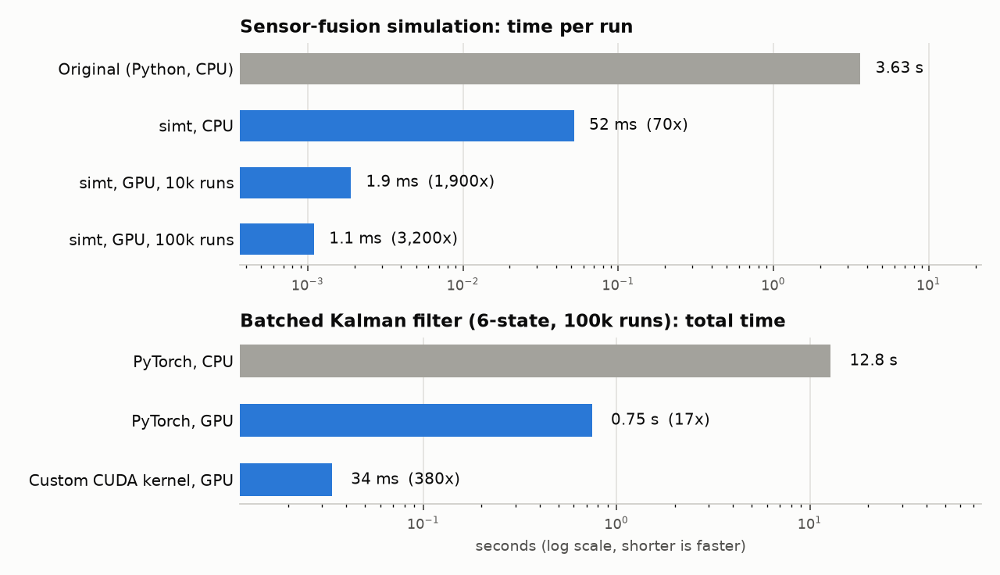

# SIMT

**Simulate It a Million Times**

simt runs a simulation thousands of times at once on a GPU. It's a learning project in GPU programming, built around a real problem.

## Why

This started with an OSSE (observing system simulation experiment) built for a satellite sensor design challenge. An OSSE tests an instrument idea in simulation before any hardware exists: invent a "true" atmosphere, simulate what the sensors would measure (including their errors), run the estimation software, and compare its answer to the truth. The question here was whether a few cheap, imperfect sensors plus a Kalman filter could measure upper-atmosphere density during a solar storm better than the models satellite operators use today.

Because sensor errors are random, one run proves nothing. The experiment has to be repeated many times (Monte Carlo) to see the typical result and the bad-luck cases. The original Python version took about 3.6 seconds per run, one run after another, so it stopped at 40 runs. Every new design question, like "what if the gauge is less accurate?", meant another batch of slow runs.

The runs don't depend on each other. So instead of looping over them one at a time, simt updates all of them together at every time step, which is exactly the kind of work GPUs are built for.

## How it's organized

| Part            | What it does                                                                                                  | Where                   |
| --------------- | ------------------------------------------------------------------------------------------------------------- | ----------------------- |
| Engine          | Runs any simulation many times at once on CPU or GPU, and keeps every run's random inputs next to its results | `engine.py`             |
| Building blocks | Smoothly varying random noise, Kalman filter updates for many runs at once                                    | `noise.py`, `kalman.py` |
| CUDA kernels    | Hand-written GPU code that runs one entire simulation inside a single GPU thread                              | `kernels.py`            |
| Examples        | A simple test case, the tracking filter benchmark, and the OSSE                                               | `examples/`             |

Adding a new simulation takes four functions: the random settings for each run, the starting state, one time step, and the final score. The engine handles the rest.

## Results

**The OSSE (the original motivation).** Each run simulates 4 days of a satellite's orbit at 30-second steps (11,520 steps): the atmosphere through a storm, three sensors with random calibration errors and drift, and a 6-state extended Kalman filter fusing them. Ported to simt and checked to give the same results as the original, within the original's own statistical uncertainty. 100,000 runs now take about 2 minutes instead of an estimated 100 hours. Design questions became sweeps instead of overnight jobs: testing 10 gauge accuracy levels with and without one of the sensors (200,000 runs) took about 6 minutes.

**Tracking filter (the benchmark).** The OSSE is specific to one project, so the GPU work is also measured on a textbook problem anyone can rebuild: a Kalman filter tracking an object's position and velocity from noisy measurements. Run 100,000 times, moving it from CPU to GPU with PyTorch made it 17x faster. A custom CUDA kernel, where each GPU thread runs one whole simulation, made it another ~22x faster on top of that.

GPU numbers are from a free Google Colab Tesla T4. Raw data from multiple tests is in `[data/](data/)`.

## Lessons and open questions

- Small batches barely benefit. Below roughly 10,000 runs, the GPU spends most of its time waiting to start work, not doing math.
- A single Python number passed into the kernel silently switched it from 32-bit to 64-bit math, which the T4 is very slow at. Fixing it roughly halved the kernel's time.
- Setting up random number generators for a million GPU threads took longer than the simulation itself. They're now set up once and reused.
- The kernel still needs to be compared against tools like `torch.compile` and JAX.
- All numbers come from one GPU (a T4). Other hardware is still untested.

